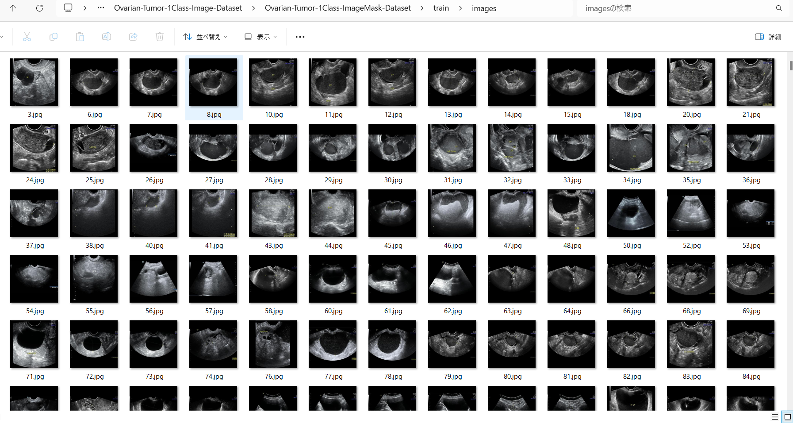
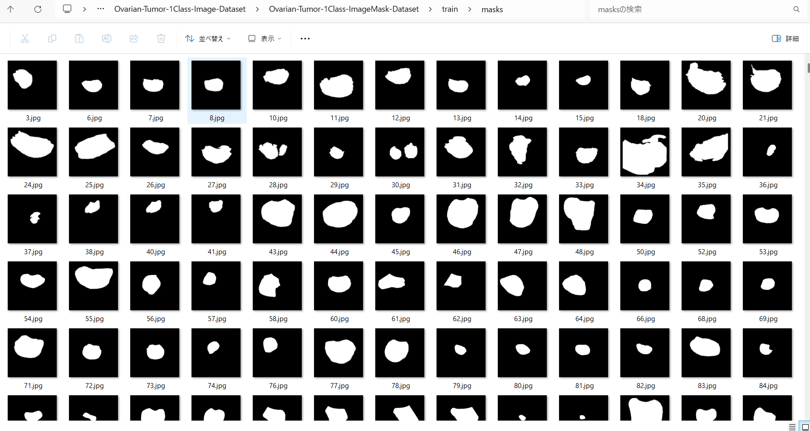
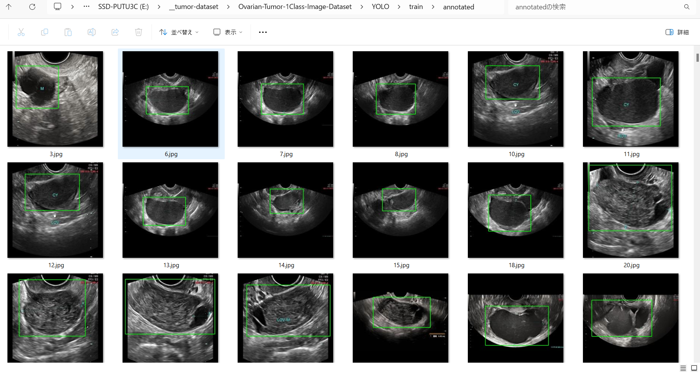

<h2>Ovarian-Tumor-1Class-Image-Dataset (2024/01/30)</h2>
This is an Ovarian Tumor 1Class dataset for Image Segmentation and Object Detection.   

<h3>1. Dataset Citatioin</h3>

The original image dataset OTU_2d used here has been taken from the following google drive.
<a href="https://drive.google.com/drive/folders/1c5n0fVKrM9-SZE1kacTXPt1pt844iAs1?usp=sharing">
MMOTU</a> 

Please see also:<a href="https://github.com/cv516Buaa/MMOTU_DS2Net">MMOTU_DS2Net</a> 

<pre>
Dataset
Multi-Modality Ovarian Tumor Ultrasound (MMOTU) image dataset consists of two sub-sets with two modalities, 
which are OTU_2d and OTU_CEUS respectively including 1469 2d ultrasound images and 170 CEUS images. 
On both of these two sub-sets, we provide pixel-wise semantic annotations and global-wise category annotations. 
Many thanks to Department of Gynecology and Obstetrics, Beijing Shijitan Hospital, 
Capital Medical University and their excellent works on collecting and annotating the data.

MMOTU : google drive (move OTU_2d and OTU_3d to data folder. Here, OTU_3d folder indicates OTU_CEUS in paper.)
</pre>

<h3>2. Download master dataset</h3>
Please download the original OTU_2d dataset from the following google drive.
<a href="https://drive.google.com/drive/folders/1c5n0fVKrM9-SZE1kacTXPt1pt844iAs1?usp=sharing">
MMOTU</a> 

The dataset has the following folder structure. 
<pre>
./
├─annotations
└─images
</pre>
The images folder contains 1469 JPG image files, and annotations mask files respectively.
 
<h3>3. Create ImageMask Dataset</h3>
<h3>
3.1 Create base dataset
</h3>
Please run Python script <a href="./generator/ImageMaskDatasetGenerator.py">ImageMaskDatasetGenerator.py</a>.
to create augmented jpg image and mask files. 
<pre>
>python create_base_dataset_512x512.py
</pre>
This script performs the following image processings. 
<pre>
1 Create 512x512 square masks from the original img files in <b>annotations</b>. 

2 Create 512x512 square images corresponding to the mask files 
from the original image files in <b>images/</b> folder
</pre>
The created <b>Ovarian-Tumor-master</b> dataset has the following folder structure. 

<pre>
./Ovarian-Tumor-master
  ├─images
  └─masks
</pre>

<h3>
3.2 Split master dataset to test, train and valid 
</h3>
By using Python script <a href="./generator/split_master.py">split_master.py</a>,
 we have finally created <b>Hippocampus-ImageMask-Dataset</b> dataset from the <b>Hippocampus-base</b>. 
<pre>
./Ovarian-Tumor-1Class-ImageMask-Dataset
├─test
│  ├─images
│  └─masks
├─train
│  ├─images
│  └─masks
└─valid
    ├─images
    └─masks
</pre>

<b>train/images samples:</b> 

 
<b>train/masks samples:</b> 

 
 
<h3>
4.Generate Annotation file
</h3>
<h3>
4.1 Generate YOLO Annotation
</h3>
To generate YOLO Anntotation files from the Ovarian-Tumor datasets, 
please run Python script <a href="./YOLOAnnotationGenerator.py">YOLOAnnotationGenerator.py</a>. 
<pre>
python YOLOAnnotationGenerator.py
</pre>

This command generates the following YOLO folders, which contains <b>test</b>, <b>train</b> and <b>valid</b> 
<pre>
./YOLO
├─test
│  └─annotated
├─train
│  └─annotated
└─valid
    └─annotated
</pre>
For example, train folder contains a lot of jpg image files, yolo annotation text files, and annotated folder,
 
<pre>
train
├─annotated
├─10.jpg
├─10.txt
├─100.jpg
├─100.txt
├─1000.jpg
├─1000.txt
├─1001.jpg
├─1001.txt
├─1002.jpg
├─1002.txt
...
</pre>
Annotated folder contains jpg image files with bounding boxes as shown below. 
 
 

<h3>
4.2 Generate TFRecord train and valid dataset
</h3>
By using <a href="https://github.com/sarah-antillia/AnnotationConverters">AnnotationConverter</a>,
we have generated TFRecord dataset from train and valid dataset in YOLO annotation. 
<pre>
TFRecord
├─train
└─valid
</pre>

<h3>
4.3 Generate COCO test dataset
</h3>
By using <a href="https://github.com/sarah-antillia/AnnotationConverters">AnnotationConverter</a>,
we have generated COCO dataset from <b>test</b> dataset in YOLO annotation. 
<pre>
COCO
└─test
</pre>

<h3>
5. Ovarian-Tumor-1Class Dataset for EfficientDet
</h3>
We have finally created the following <b>Ovarian-Tumor-1Class-EfficientDet-Dataset</b> for 
<a href="https://github.com/google/automl/tree/master/efficientdet">efficientdet</a> object detection from TFRecord(train, valid) and COCO(test) dataset.
<pre>
Ovarian-Tumor-EfficientDet-Dataset
├─test
├─train
└─valid
</pre>

You can download this dataset from the googole drive 
<a href="https://drive.google.com/file/d/1D3q1iuOfdBWqG-Zw_ugQfX0mNwd_sD4e/view?usp=sharing">
Ovarian-Tumor-1Class-EfficientDet-Dataset.zip</a>

